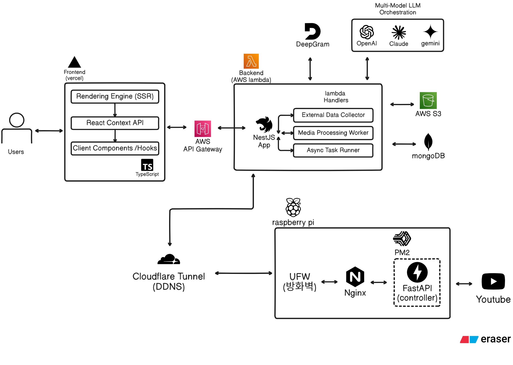

## ⚠️ Security & Confidentiality Notice

> **본 레포는 사내 보안 규정을 철저히 준수합니다.** 

> 프로젝트의 실제 소스 코드, 서버 인프라의 상세 IP 정보, API Key 등 기밀 정보는 일절 포함되어 있지 않습니다. 오직 기술적 의사결정 과정(Technical Decision Making)과 아키텍처 설계 역량을 증명하기 위한 목적으로 작성되었습니다.

---

## 🚀 Project: 지능형 사내 업무 지원 서비스

**[In-house Decision Support System]**

매일 쏟아지는 방대한 양의 정보를 효율적으로 필터링하고 분석하여, 의사결정 과정에 도움을주고고 인사이트를 제공하기 위한 통합 시스템입니다. 

기획부터 아키텍처 설계, 인프라 구축, 서비스 개발까지 1인 주도로 전 과정을 수행하고 있습니다.

  
   
  <em>(이미지를 클릭하면 상세 아키텍처 설계 문서로 이동합니다.)</em>

### 🌟 Key Features

* **Data Intelligence**: 뉴스, 유튜브 등 다양한 채널의 입력 정보 수집 및 요약정리
* **AI-Powered Insights**: RAG(Retrieval-Augmented Generation) 및 LLM을 활용한 핵심 지식 추출 및 요약

---

## 🏗️ Information Architecture

| 항목 | 위치 | 주요 내용 |
| --- | --- | --- |
| **🏗️ 아키텍처** | [`ARCHITECTURE.md`](./ARCHITECTURE.md) | 하이브리드 인프라 구성 및 데이터 Flow 시각화 |
| **🛠️ 기술 스택** | [`tech-stack/`](./tech-stack/) | 기술 선정 근거 및 대안 비교 기록 (ADR) |
| **📂 문제 해결** | [`troubleshooting/`](./troubleshooting/) | 단계별 난관 및 엔지니어링 해결 과정 (`Infra`, `BE`, `FE`, `AI`) |
| **🖼️ 실행 결과** | [`samples/`](/samples/) | 서비스 구동 화면 및 기능별 결과 (익명화 완료) |

---

### 🛠️ Main Tech Stack

| Category | Technology | 
| --- | --- |
| **Language** | **TypeScript** | 
| **Backend** | **NestJS**, FastAPI | 
| **Frontend** | **Next.js**, Tailwind CSS | 
| **Database** | **MongoDB**, AWS S3 | 
| **Infrastructure** | **Raspberry Pi 4B**, AWS Lambda |
| **Network** | **Cloudflare Tunnel**, Vercel |
| **AI / ML** | **Multi-Model LLM Orchestration, STT (Deepgram)** |
