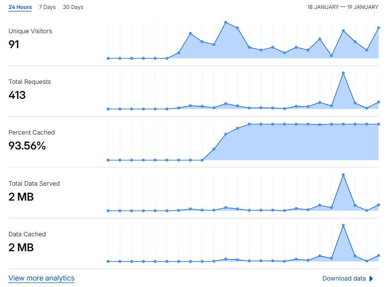

# [ADR] Cloudflare Tunnel을 활용한 보안 터널링 및 DDNS 구축

## 1. 배경 (Context)

* 온프레미스 환경의 **Raspberry Pi** 노드는 유동 IP 환경에 위치하고 있어 외부(AWS Lambda)와의 통신을 위한 **DDNS(Dynamic DNS)** 설정이 필수적이었습니다.
* 초기에는 `DuckDNS`와 공유기 포트포워딩(80, 443)을 통해 외부 접속 환경을 구축하고 HTTPS 인증을 완료했습니다.

## 2. 문제 분석 (Problem Analysis)

* **가용성 저하**: `DuckDNS` 자체 서버의 빈번한 다운으로 인해 인프라의 안정성이 크게 저하되었습니다.
* **보안 위협 (Bot Attacks)**: 포트포워딩으로 포트를 개방하자마자 외부 봇(Bot)들의 무차별적인 스캔 및 공격 시도가 디스코드 웹훅 로그를 통해 다수 감지되었습니다.
* **결론**: 포트를 개방하는 전통적인 방식으로는 사내망 보안을 담보할 수 없다고 판단하여, **Inbound Port Zero-Exposure** 방식의 대안을 모색했습니다.

## 3. 대안 검토 (Alternatives)

1. **기존 포트포워딩 유지**: 방화벽 설정을 강화하더라도 공격 표면(Attack Surface)이 노출되어 있어 잠재적 위험이 큼.
2. **Cloudflare Tunnel 도입**: 포트 개방 없이 아웃바운드 연결만으로 보안 터널을 생성하며, Cloudflare의 강력한 보안 규칙을 활용 가능함.

## 4. 최종 결정 (Decision)

**Cloudflare Tunnel을 활용한 사내망-클라우드 간 보안 커넥션 구축**

## 5. 기대 효과 및 보안 강화 (Consequences)

* **Zero-Inbound Port**: 모든 수신 포트를 폐쇄하여 외부 스캔 공격을 원천 차단했습니다.
* **WAF 및 Access Control**: Cloudflare Security Rules를 적용하여 특정 경로와 유효한 API-Key를 보유한 요청만 통과하도록 설정했습니다.
* *Rule 예시*: `(not starts_with(http.request.uri.path, "/특정경로")) or (any(http.request.headers["api key"][*] eq "api key"))`

* **안정성 확보**: 글로벌 CDN 인프라인 Cloudflare를 통해 기존 DuckDNS 대비 비약적으로 향상된 가용성을 확보했습니다.

    

---
