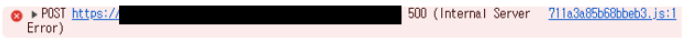
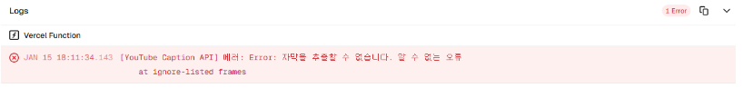
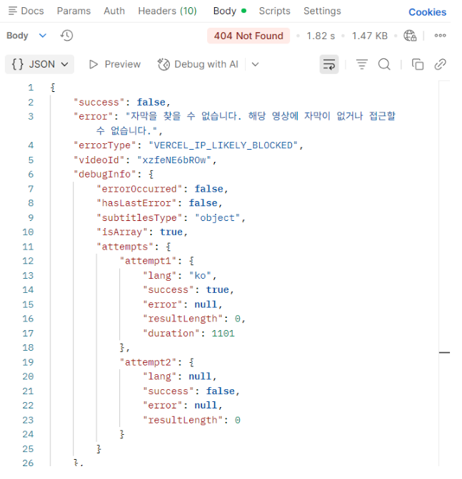

# [ADR] Raspberry Pi 기반 데이터 수집 서버버 도입

## 1. 배경 (Context)
* 서비스의 기능인 **유튜브 콘텐츠 분석 및 자막 수집** 기능을 구현하여 Vercel(Frontend) 및 AWS Lambda(Backend) 환경에서 배포 및 테스트를 진행했습니다.
* 로컬 환경(가정용 IP)에서는 정상 작동하던 기능이 클라우드 환경 배포 직후 **500 Internal Server Error** 및 **404 Not Found** 에러와 함께 작동이 중단되는 현상을 발견했습니다.

## 2. 문제 분석 (Problem Analysis)
* **에러 로그**: `VERCEL_IP_LIKELY_BLOCKED` 등의 에러 타입을 통해 클라우드 플랫폼(Vercel, AWS 등)의 공인 IP 대역이 콘텐츠 제공사(YouTube 등)로부터 선제적으로 차단되었음을 확인했습니다.

    

    

    

* 특이사항: 

    - 단 1회의 요청에도 즉시 차단 발생.
    - 동일한 코드가 로컬 IP 환경에서는 문제없이 작동함.

* 결론: AWS Lambda 등으로 서버를 이전하더라도 클라우드 IP 대역을 사용하는 한 동일한 차단 문제가 발생할 것으로 판단했습니다.

## 3. 문제 해결 방안
1. **유료 프록시 IP 구매**: 가정용(Residential) IP 대역 구매 시 비용 부담이 크며 지속적인 관리가 필요함.
2. **로컬 서버 구축**: 기존 소유 중인 하드웨어를 활용하여 물리적 비용을 최소화하고, 차단 위험이 낮은 가정용 IP 환경을 활용 가능함.

## 4. 최종 결정 (Decision)
**라즈베리 파이 4B(Raspberry Pi 4B)를 활용한 온프레미스 환경 구축**

## 5. 기대 효과 (Consequences)
* **비용 최적화**: 24시간 가동 시에도 월 전기료 1,000원 미만의 저비용으로 운영 가능.
* **안정적인 수집**: 클라우드 IP 차단 문제를 근본적으로 해결하여 데이터 수집의 연속성 확보.
* **인프라 제어권**: `ufw`와 `Cloudflare Tunnel`을 직접 설정하여 사내 보안 규정을 준수하는 독립적인 인프라 레이어 구축.